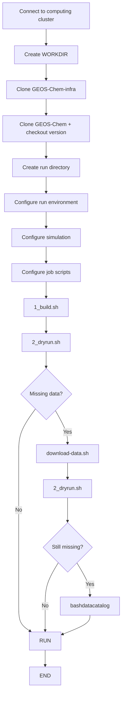

doc
===

This directory contains tutorials describing how to configure and run GEOS-Chem simulations.

Contents
--------

* [simulation-guide](simulation-guide.md): Guide to running simulations on GRICAD/CIMENT or ige-calcul.
Here is a flowchart of the workflow that you will find in the simulation guide:

